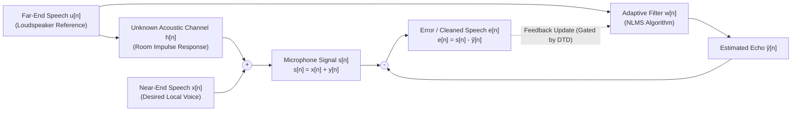
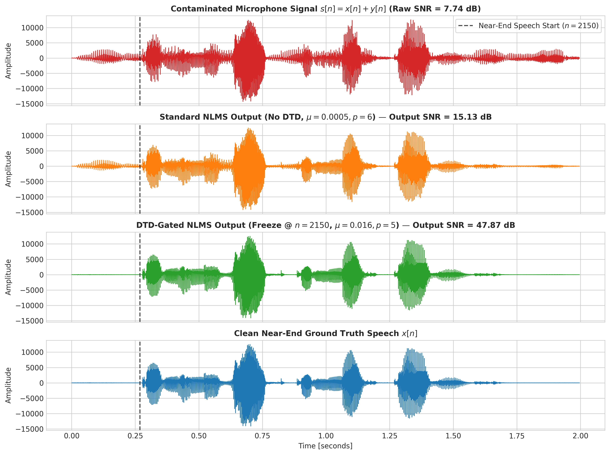
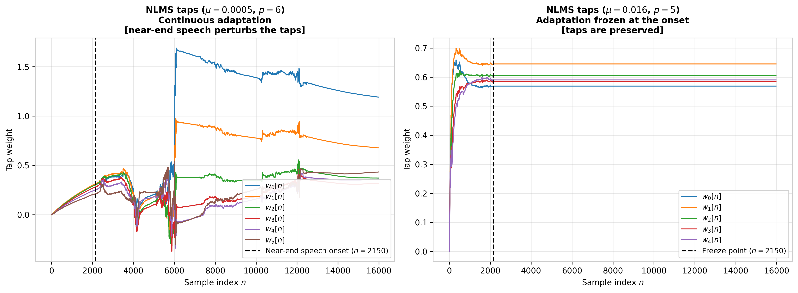
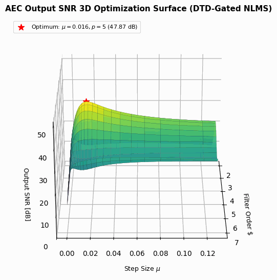
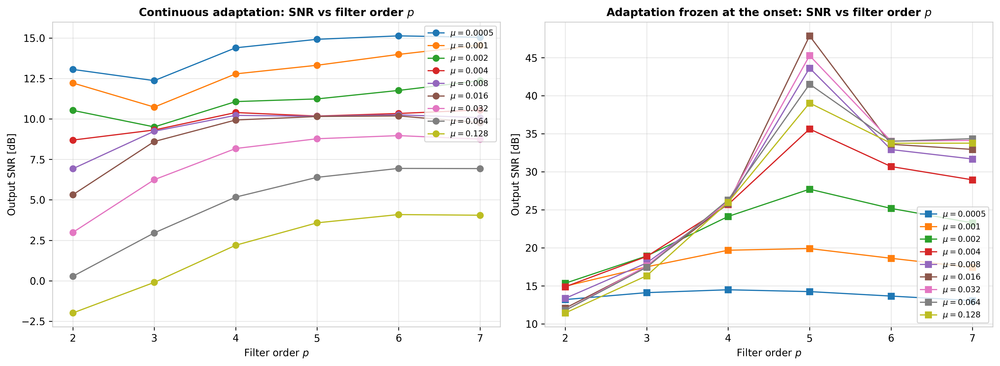
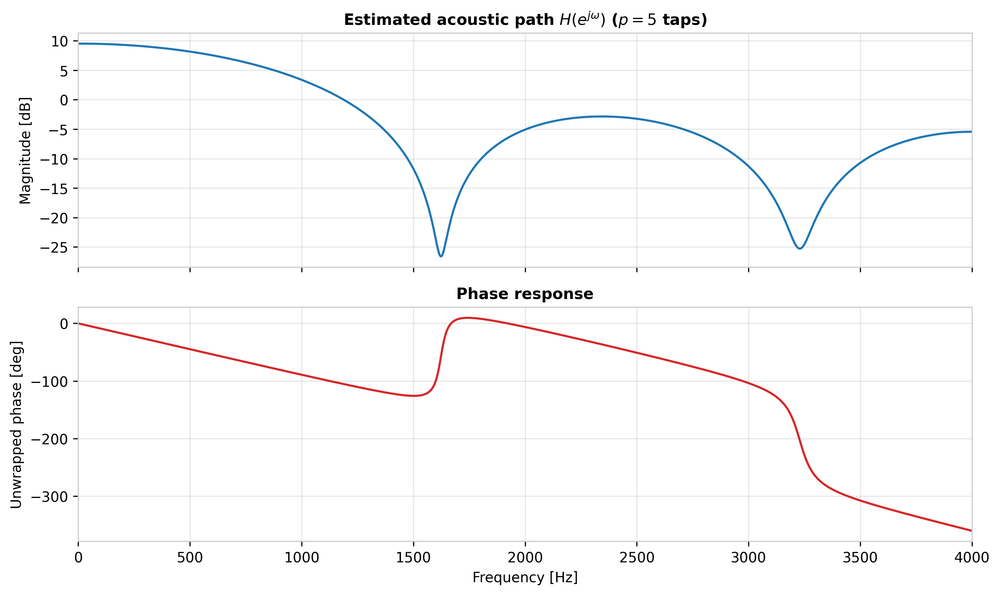

# Acoustic Echo Cancellation (AEC) with Normalized LMS & Double-Talk Detection

[]()
[]()
[-orange.svg)]()
[]()
[]()
[]()
[](LICENSE)

An implementation of an **Acoustic Echo Canceler (AEC)** based on the **Normalized Least Mean Squares (NLMS)** adaptive algorithm with **Double-Talk Detection (DTD)** in Python. The DTD is *ideal*: it freezes the filter at the known onset of near-end speech, which shows the upper bound of the technique but is not a detector that works on unknown signals (see [Limitations](#limitations)).

This project estimates and cancels the acoustic echo generated by an unknown room coupling channel in hands-free telecommunications, evaluating baseline SNR, 2D convergence parameter sweeps ($\mu, p$), tap weight adaptation dynamics, and acoustic frequency response identification.

---

## Executive Summary & Physical Signal Model

In full-duplex hands-free voice communications, speech from a far-end speaker $u[n]$ played through a loudspeaker is reflected across the acoustic enclosure and picked up by the near-end microphone, creating an acoustic echo $y[n] = (h * u)[n]$ that corrupts the local desired speech $x[n]$:

$$
s[n] = x[n] + y[n] = x[n] + \sum_{k=0}^{M-1} h_k u[n-k]
$$



The adaptive filter iteratively synthesizes an echo estimate $\hat{y}[n] = \mathbf{w}^T[n] \mathbf{u}[n]$ and subtracts it from the composite microphone signal $s[n]$, transmitting the error signal $e[n] = s[n] - \hat{y}[n]$ to the far end.

---

## System Specifications

| Parameter | Specification / Value | Description |
| :--- | :--- | :--- |
| **Audio Sampling Rate ($f_s$)** | $8000\text{ Hz}$ ($8\text{ kHz}$) | Standard narrowband telephony standard (ITU-T G.711) |
| **Quantization** | $16\text{ bits}$ PCM (Monophonic WAV) | Signed integer normalized to float |
| **Far-End Reference ($u[n]$)** | `data/far_end.wav` | Far-end speech creating the acoustic coupling |
| **Microphone Pickup ($s[n]$)** | `data/mic.wav` | Contaminated composite speech signal ($x[n] + y[n]$) |
| **Near-End Ground Truth ($x[n]$)** | `data/near_end.wav` | Clean local speaker voice (active from $n = 2150$) |
| **Adaptive Algorithm** | Normalized LMS (NLMS) | Gradient descent with instantaneous power normalization |
| **Step-Size Range ($\mu$)** | $\{0.0005, 0.001, 0.002, \dots, 0.128\}$ | 9 candidate convergence parameters |
| **Filter Orders ($p$)** | $\{2, 3, 4, 5, 6, 7\}$ taps | Evaluated FIR filter lengths |
| **DTD Freeze Point** | Sample index $n_0 = 2150$ | Known onset of near-end speech (ideal DTD) |

---

## Mathematical Formulation

### 1. Signal-to-Noise Ratio (SNR)

The Signal-to-Noise Ratio relative to the clean desired local speech $x[n]$ is defined as:

$$
\mathrm{SNR} = 10 \log_{10}\left( \frac{\sum_{n} x^2[n]}{\sum_{n} (y_{\mathrm{out}}[n] - x[n])^2} \right) \quad [\text{dB}]
$$

- For the **unprocessed microphone signal** ($y_{\mathrm{out}}[n] = s[n]$), distortion is the raw echo $d[n] = s[n] - x[n] = y[n]$.
- For the **adaptive filter output** ($y_{\mathrm{out}}[n] = e[n]$), distortion is the residual error $d[n] = e[n] - x[n]$.

---

### 2. Normalized Least Mean Squares (NLMS)

To ensure convergence stability invariant to signal amplitude variations, the standard LMS gradient update is normalized by the instantaneous regressor signal energy $\|\mathbf{u}[n]\|^2$:

$$
e[n] = s[n] - \mathbf{w}^T[n] \mathbf{u}[n]
$$

$$
\mathbf{w}[n+1] = \mathbf{w}[n] + \frac{\mu}{\|\mathbf{u}[n]\|^2 + \epsilon} e[n] \mathbf{u}[n]
$$

where $\mathbf{u}[n] = [u[n], u[n-1], \dots, u[n-p+1]]^T$ is the tapped delay line vector, $\mu$ is the dimensionless step size ($0 < \mu < 2$), and $\epsilon = 10^{-8}$ is a regularization constant.

---

### 3. Double-Talk Detection (DTD) Rationale

When only the far-end speaker is active ($n < 2150$), $s[n] = y[n]$ and the error signal $e[n] = y[n] - \hat{y}[n]$ represents pure estimation error, driving optimal convergence of $\mathbf{w}[n] \to \mathbf{h}$.

However, when the near-end speaker begins talking (**Double-Talk**, $n \ge 2150$), the microphone signal becomes $s[n] = x[n] + y[n]$. Here, $x[n]$ acts as massive uncorrelated additive perturbation. An ungated adaptive filter attempts to cancel $x[n]$, causing the tap weights to diverge rapidly and severely distorting the local speaker's voice.

By deploying an ideal Double-Talk Detector (DTD) that knows $n_0$ in advance, adaptation is frozen when near-end speech is active:

$$
\mathbf{w}[n+1] = \begin{cases} 
\mathbf{w}[n] + \frac{\mu}{\|\mathbf{u}[n]\|^2 + \epsilon} e[n] \mathbf{u}[n], & n < 2150 \\
\mathbf{w}[2150], & n \ge 2150
\end{cases}
$$

---

## Experimental Results & Benchmark Analysis

### Performance Summary

| Configuration | Optimal Parameters | Output SNR (dB) | SNR Improvement | Audio Quality / Perception |
| :--- | :--- | :--- | :--- | :--- |
| **Unprocessed Raw Input** | N/A | $7.74\text{ dB}$ | $0.00\text{ dB}$ (Baseline) | Severe acoustic echo audible |
| **Standard NLMS (No DTD)** | $\mu = 0.0005, p = 6$ | $15.13\text{ dB}$ | $+7.39\text{ dB}$ | Echo reduced, but local voice distorted |
| **NLMS, frozen at $n_0 = 2150$ (ideal DTD)** | $\mu = 0.016, p = 5$ | **$47.87\text{ dB}$** | **$+40.13\text{ dB}$** | Echo strongly suppressed, near-end speech preserved |

---

### Time-Domain Waveforms

<p align="center">
  
  <br/>
  <em>Figure 1: Time-domain signal comparison: (1) Contaminated microphone input, (2) Standard NLMS output (showing distortion during double-talk), (3) DTD-Gated NLMS output, and (4) Clean ground-truth speech.</em>
</p>

---

### Filter Coefficient Adaptation & Divergence Analysis

<p align="center">
  
  <br/>
  <em>Figure 2: Time evolution of adaptive FIR filter taps $w_k[n]$: Left: Standard NLMS diverges after $n=2150$ due to near-end voice interference. Right: DTD-gated NLMS freezes at $n=2150$, preserving optimal echo cancellation weights.</em>
</p>

---

### 2D & 3D Parameter Grid Search ($\mu$ vs $p$)

<p align="center">
  
  <br/>
  <em>Figure 3A: 3D rotating parameter optimization surface of Output SNR vs Filter Order $p$ and Step Size $\mu$ (DTD-Gated NLMS), highlighting the global optimum at $\mu = 0.016, p = 5$ ($47.87\text{ dB}$).</em>
</p>

<p align="center">
  
  <br/>
  <em>Figure 3B: Output SNR curves as a function of filter order $p$ and step size $\mu$: Left: Standard NLMS requires very small $\mu = 0.0005$ to limit divergence. Right: DTD-gated NLMS achieves optimal convergence at $\mu = 0.016$ and $p = 5$.</em>
</p>

---

### Room Acoustic Channel Frequency & Phase Response

Evaluating the frequency response of the optimal converged FIR filter $\mathbf{w}[2150]$ identifies the physical transfer function $H(e^{j\omega})$ of the room acoustic path:

<p align="center">
  
  <br/>
  <em>Figure 4: Frequency response $H(e^{j\omega})$ of the estimated acoustic room channel (FIR $p=5$ taps): Magnitude response (top) exhibiting bandpass attenuation, and unwrapped phase (bottom) demonstrating linear phase delay.</em>
</p>

---

## Repository Structure

```text
.
├── README.md                          # Technical documentation
├── Acoustic_Echo_Cancellation.ipynb   # Interactive Jupyter Notebook (with audio players)
├── main_echo_cancellation.py          # Standalone script: grid search, audio export, figures
├── requirements.txt                   # Python dependencies
├── LICENSE                            # MIT
├── .gitignore
│
├── data/                              # Input Audio WAV Signals (8 kHz, 16-bit PCM)
│   ├── near_end.wav                   # Desired near-end speech x[n] (ground truth)
│   ├── far_end.wav                    # Far-end reference u[n] (echo source)
│   └── mic.wav                        # Microphone pickup s[n] = x[n] + y[n]
│
├── output/                            # Processed Audio Outputs
│   ├── signal_canceled_nlms.wav       # Output processed with standard continuous NLMS
│   └── signal_canceled_dtd.wav        # Output of the NLMS frozen at the onset
│
└── docs/                              # Documentation & High-Resolution Figures
    ├── assignment.pdf                 # Official assignment handout / specification
    └── figures/                       # 300 DPI plots and the 3D surface animations
        ├── snr_3d_surface_rotation.gif
        ├── snr_DTD_rotation.gif
        ├── time_domain_signals.png
        ├── filter_coefficient_evolution.png
        ├── snr_grid_search_curves.png
        └── acoustic_channel_frequency_response.png
```

---

## Getting Started & Usage

### Prerequisites
- Python 3.10 or higher.
- NumPy, SciPy, Matplotlib, Jupyter.

```bash
pip install -r requirements.txt
```

### 1. Run Interactive Jupyter Notebook
Open the notebook, which includes audio players for the input and output signals:

```bash
jupyter notebook Acoustic_Echo_Cancellation.ipynb
```

### 2. Run Standalone Python Script
Run the grid search, write the cancelled audio to `output/` and regenerate the four static figures in `docs/figures/`:

```bash
python3 main_echo_cancellation.py
```

---

## Limitations

- **The DTD is an oracle.** The freeze index $n_0 = 2150$ is known a priori, not estimated. A practical canceler needs a detector such as the Geigel algorithm or a normalized cross-correlation test between the far-end signal and the residual.
- **Parameters are tuned on the evaluation signal.** $\mu$ and $p$ are chosen by the same SNR that is reported, so the figures are best-case for this recording.
- **Very short filters.** The optimum $p = 5$ only suits this short acoustic path; a real room impulse response needs hundreds to thousands of taps.
- The 3D surface animation is rendered separately and is not produced by the script.

## Author

[Daniel Pereira Riquelme](https://github.com/DANIEL-PEREIRA-RIQUELME), as a Digital Signal Processing course project. The audio recordings and the task specification (`docs/assignment.pdf`) come from the course.

Released under the [MIT License](LICENSE).
